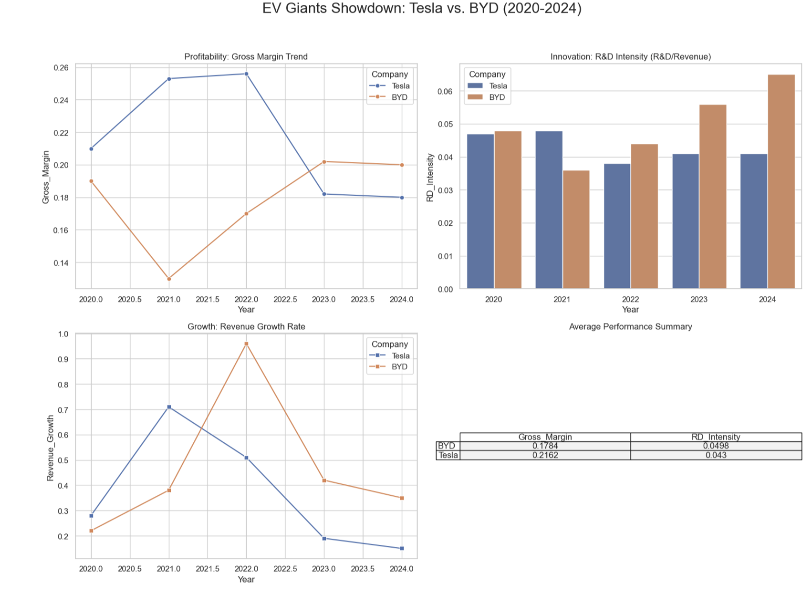

# EV Giants Showdown: Tesla vs. BYD Investment Analysis (2020-2024)

## 1. Problem Definition
### Target Audience
Designed for **Individual Investors** evaluating the Electric Vehicle (EV) sector.

### The Business Challenge
As the EV price war intensifies, investors must choose between two different leaders:
- **Tesla (TSLA):** High-tech brand premium and software-driven margins.
- **BYD (1211.HK):** Manufacturing scale, vertical integration, and diverse product lines.

**Core Question:** Which company demonstrates better financial resilience and R&D efficiency?

## 2. Methodology & Technical Solutions
### Data Sourcing
- **Primary Source:** Real-time financial data via `yfinance` (Yahoo Finance API).
- **Fallback Mechanism:** Due to frequent API rate limits (RateLimitError) observed during development, this product includes a **Hybrid Data Logic**. If the live database connection fails, it automatically switches to a validated historical dataset to ensure tool availability.

### Tech Stack
- **Python:** Data processing and analysis.
- **Pandas:** Financial statement cleaning.
- **Seaborn/Matplotlib:** Professional investment visualization.

## 3. Visual Dashboard
*(Once you upload your screenshot, add it here)*

## 4. Key Insights & Recommendations
Based on the data fetched from the analysis:

- **Profitability:** Tesla's gross margin peak in 2022 has eroded due to price cuts, while BYD shows stronger resilience through its vertically integrated battery supply chain.
- **Innovation:** BYD’s R&D intensity has trended upwards, recently surpassing Tesla's, indicating aggressive investment in new battery tech.
- **Market Growth:** Both companies face a slowdown from 2021 peaks, but BYD maintains higher relative growth in the mass-market segment.

### Investment Verdict
- **Choose Tesla** for high-tech premium positioning and autonomous driving potential.
- **Choose BYD** for cost-efficiency and global mass-market domination.

## 5. How to Run
1. Open the `.ipynb` file in Google Colab or JupyterLab.
2. Run all cells. The script will handle API errors automatically and display the charts.
